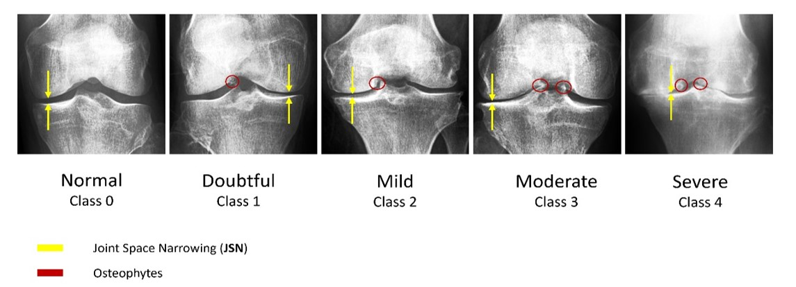
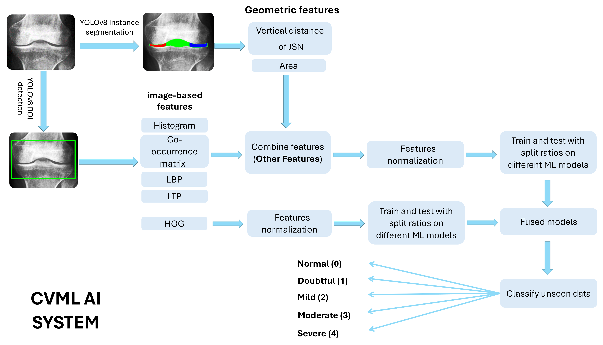
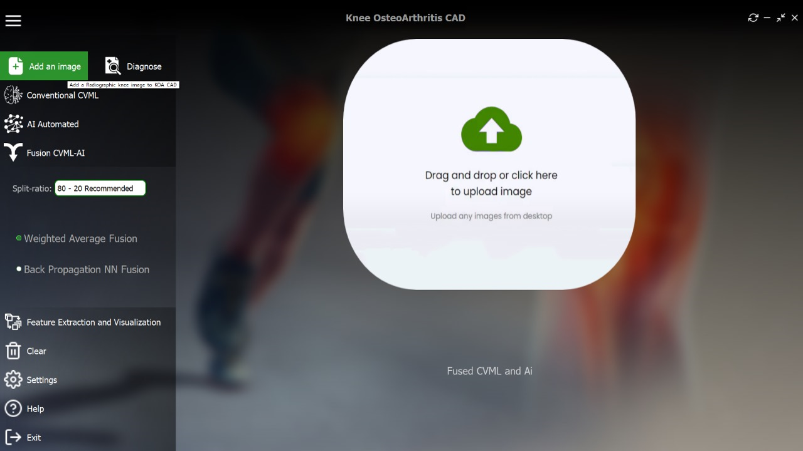
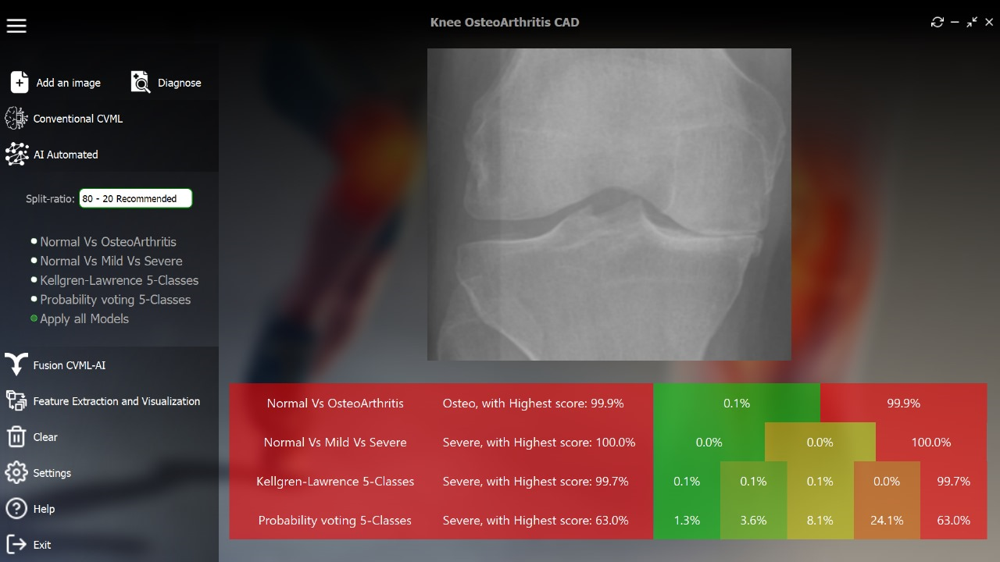
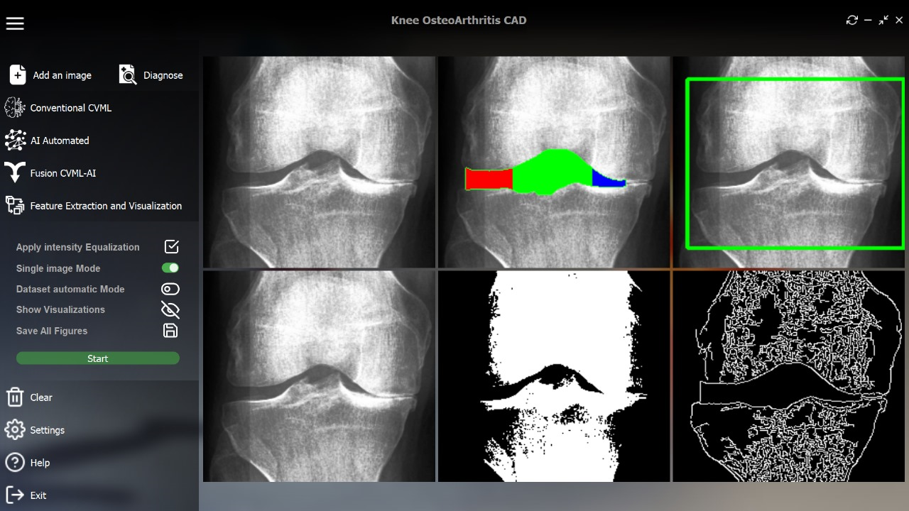

# 🦵 Knee Osteoarthritis Diagnostic Application (KOA-CAD)

**KOA-CAD** is a computer-aided diagnosis (CAD) desktop application for **automatic knee osteoarthritis (KOA) assessment** from medical images.  
The system integrates **conventional image processing**, **machine learning**, and **deep learning (CNN-based)** models to deliver accurate and clinically interpretable KOA severity predictions.

---

## 🧠 KOA-CAD System Structure and Workflow

The KOA-CAD framework follows a **multi-stage diagnostic pipeline**, starting from image preprocessing and feature extraction and ending with automated KOA severity classification.

---

### 1️⃣ Knee Osteoarthritis Grading Standard



The system follows a **standard clinical KOA grading scheme**, where disease severity is determined based on:
- Joint space narrowing  
- Osteophyte formation  
- Structural deformation  

These grades are used as **ground-truth labels** for both conventional machine learning and deep learning models.

---

### 2️⃣ Conventional Machine Learning (CVML) Pipeline



The **CVML pipeline** represents a classical KOA diagnosis approach and includes:

1. Image preprocessing ( normalization, ROI extraction)  
2. Handcrafted feature extraction  
3. Feature normalization and selection  
4. Machine learning classifiers (e.g., SVM, Random Forest, KNN)  
5. KOA severity prediction  

This pipeline provides **high interpretability** and serves as a baseline for comparison with deep learning models.

---

### 3️⃣ Geometric Feature Extraction Module


This module extracts **clinically meaningful geometric features**, such as:
- Joint Space Width (JSW)  
- Central and minimum joint gap measurements  
- Bone contour distances and symmetry metrics  

These features quantitatively describe cartilage degeneration and are used as inputs to the **conventional ML models**.

---

### 4️⃣ Deep Learning Model Architecture (CNN)


In parallel with CVML, KOA-CAD employs a **Convolutional Neural Network (CNN)** that learns discriminative features **directly from knee images**.

**CNN workflow:**
- Input knee image  
- Convolution and pooling layers for feature learning  
- Fully connected layers for classification  
- Output KOA severity grade  

This approach improves robustness and performance, especially in complex cases where handcrafted features may be insufficient.

---

### 5️⃣ Desktop Application – Main Graphical User Interface



The desktop application provides a **user-friendly graphical interface** that allows users to:
- Load knee images  
- Select diagnostic mode (CVML or CNN-based)  
- Visualize intermediate processing steps  
- Run automated diagnosis with a single click  

---

### 6️⃣ Desktop Application – KOA Severity Prediction Output



The output panel displays:
- Predicted KOA severity grade  
- Confidence score (if available)  
- Visual feedback supporting the diagnostic decision  

This enhances **clinical transparency and interpretability**.

---

### 7️⃣ Desktop Application – Image Processing Workflow



This figure illustrates the **end-to-end diagnostic workflow**, including:
- Image enhancement  
- Region-of-interest localization  
- Feature extraction or CNN inference  
- Final KOA severity prediction  

---

## ⚙️ Installation Instructions

1. Run `python-3.11.7.exe` from the **setup** folder  
   - ✔️ Check **“Add Python to PATH”**
2. Double-click `setup.bat` to install dependencies  
   - 🌐 Internet connection required for initial setup

---

## ▶️ Running the Application

- Double-click `run.bat`  
- No internet connection is required after installation

---

## 🤖 Models and Folder Structure

⚠️ **Pre-trained models are not included** due to large size (~16.5 GB).

📥 **Download models from Hugging Face:**  
https://huggingface.co/osamahabdulmahmod/Models

📂 Place the downloaded models as follows:

```text
Models/
 ├── Fusion Models/                      # Hybrid CVML + DL models
 ├── New Ai Automated Models/            # CNN-based KOA classifiers
 ├── New Conventional Models/            # ML models using handcrafted features
 └── NewFeatureExtractionAndVisualizationModels/
                                        # Feature extraction & visualization


## 👨‍💻 Authors

| # | Name |
|---|------|
| 1 | **Osamah F. Abdulmahmod** |
| 2 | **Shuaib Abdulsalam** |
| 3 | **Mohammad Sayed** |
| 4 | **Amr Kamal** |
| 5 | **Bassma Alaa** |

### 🎓 Supervisor

| # | Name |
|---|------|
| 1 | **Prof. Ahmed M. Badawi** |

